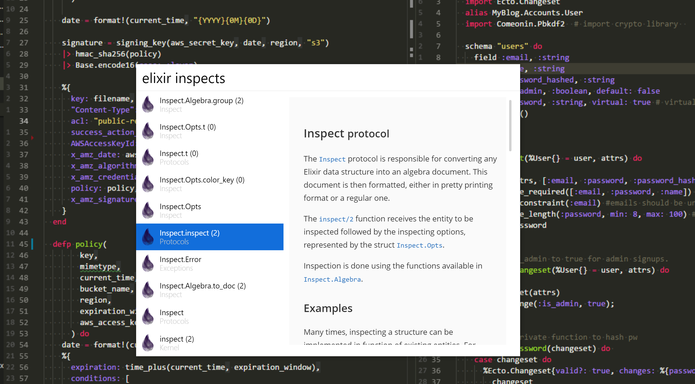
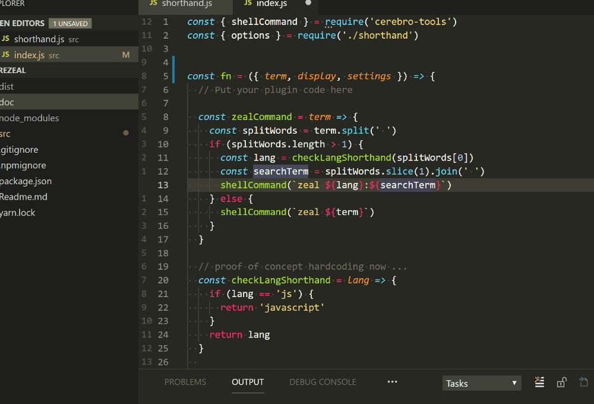
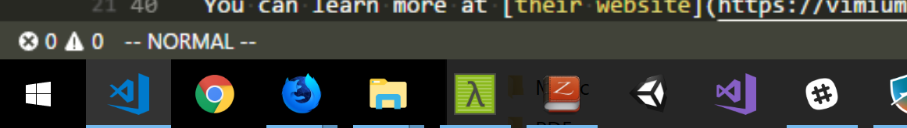
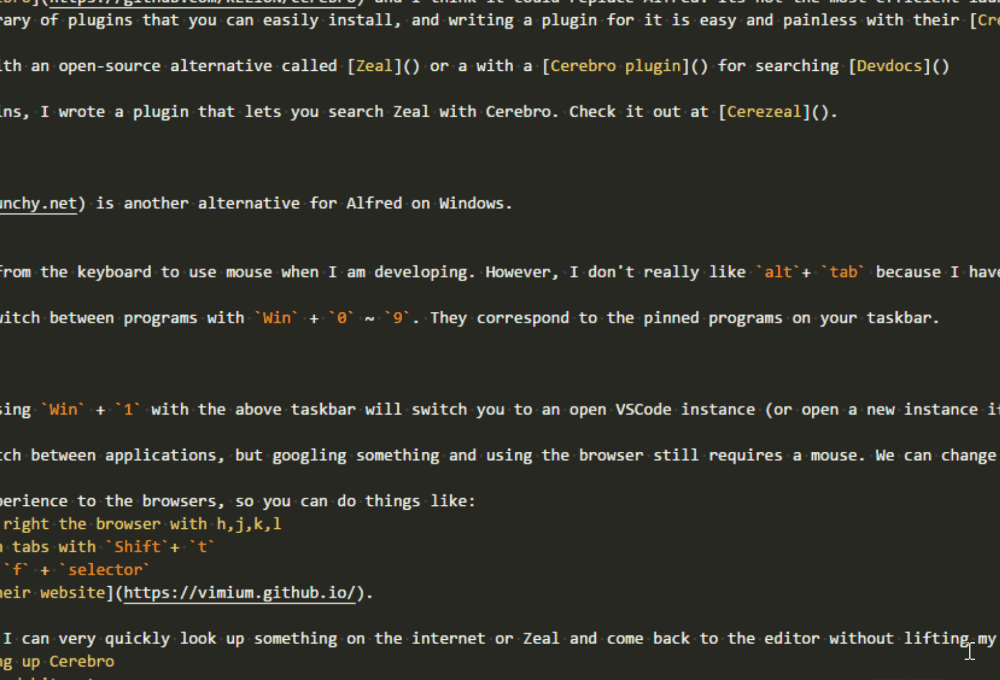

On my third year of law school, I got a 13-inch 2013 Macbook. I immediately fell in love with OSX at the time and used it religiously since then, even with meagre 4gb ram (in hindsight I really wish I opted for an 8gb ram version). When I decided it was finally time to upgrade from 4gb ram, I decided to go for XPS15 rather than Macbook. This was because in New Zealand, 15-inch Macbooks were at least $1000 dollars more expensive than a better specced XPS15. I was also turned off by the lack of ports and the touch bar of the new Macbooks.

I spent some time tinkering with my XPS 15 and I like it (but not _love_ it like Macbook - that's another blog post) and I would like to share some tips to make development on Windows better using an open source launcher called [Cerebro](https://github.com/KELiON/cerebro).

## Replacing Alfred and Dash

On OSX, I loved using [Alfred](https://www.alfredapp.com). It was a glue for all my workflows, whether it was with quick note-taking on Evernote, switching between apps, running scripts, or looking up stuff on [Dash](https://kapeli.com/dash).

The default launcher from `Win` button can be useful to search and start apps, but It's not as good as Alfred.

After looking around, I've found [Cerebro](https://github.com/KELiON/cerebro) and I think it could replace Alfred for me. Its not the most efficient launcher as it is built on Electron, but I found it is light enough for me. It has a growing library of plugins that you can easily install, and writing a plugin for it is easy and painless with their [Create Cerebro Plugin](https://github.com/KELiON/create-cerebro-plugin). 

Dash could be replaced with an open-source alternative called [Zeal](https://zealdocs.org/) or a with a [Cerebro plugin](https://github.com/KELiON/cerebro-devdocs) for searching on [Devdocs](http://devdocs.io/)

Speaking of Cerebro Plugins, I wrote a simple plugin that lets you search Zeal with Cerebro. Check it out at [Cerezeal](https://github.com/horizon0708/cerezeal).

 

  
Click to see cerezeal in action

  

 
 

If you don't like Cerebro, [Launchy](https://www.launchy.net) is another alternative for Alfred on Windows. 

## Mouseless Manuevering with Vimium

I hate lifting my hands from the keyboard to use mouse when I am coding. Within the editor, [Vim](https://www.vim.org) or a Vim add-on for the VSCode solves this.

However, A lot of my development is also done on Google and [StackOverflow](https://xkcd.com/979/) which means I need to switch between my browser and my editor _a lot_.

 For switching between apps, There is the traditional and the most well known way of `Alt`+ `Tab`, I am not a fan of it because I have to look for the window I want for a second unless I was using it last before switching to the current window (First world problem. I know). Instead, in Windows 10, you can switch between programs with `Win` + `0` ~ `9`. They correspond to the pinned programs on your taskbar.

To give an example, pressing `Win` + `1` with the above taskbar will switch you to an open VSCode instance (or open a new instance if it is not open). 

So now we can easily switch between applications, but googling something and using the browser still requires a mouse. We can change that with [Vimium](https://vimium.github.io/).

Vimium brings the Vim experience to the browsers, so you can do things like:
- scroll left, down, up, right the browser with `h`,`j`,`k`,`l`
- search through all open tabs with `Shift`+ `t`
- navigate to links with `f` + `selector`.

It can do much more and you can learn more on [their website](https://vimium.github.io/).

With Vimium and Cerebro, I can very quickly look up something on the internet or Zeal and come back to the editor without lifting my hands from the home row of my comfy ergonomic keyboard. 

So when I need to look up something, it goes like this:
1. `Ctrl`+`Space` to bring up Cerebro
2. Type my search query and hit enter.
3. Use Vimium to browse the search result. 
4. Return to my editor with `Alt` + `tab` or with `Win` + `1`.

This sounds complicated, but its fast and effortless when you get used to it.

  
Click to see vimium in action

  
  all done with keyboard

## Other tips
- [Cmder](http://cmder.net/) is a great shell replacement for windows.
- [Chocolatey](https://chocolatey.org/) for package management.
- I run a triple monitor setup with my XPS 15. XPS 15 has a 4k screen but my other screens are FHD. This means that normally, the mouse may get 'stuck' because the cursor only goes to the next screen on some part of the screen, which can get kinda annoying. [Little Big Mouse](https://github.com/mgth/LittleBigMouse) solves this.
- If my development isn't strictly front-end, I use [Docker](https://www.docker.com).
- I used to use [Bash on Windows](https://docs.microsoft.com/en-us/windows/wsl/about) a lot, but I found that I don't really need it anymore with docker.

## Ending notes

Thanks for reading! I would like to know what your tips and tricks for making development in Windows 10 easier! [Tweet them to me](https://twitter.com/LLHorizon) or leave a comment.